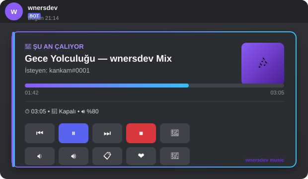
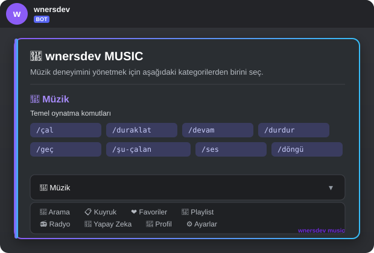
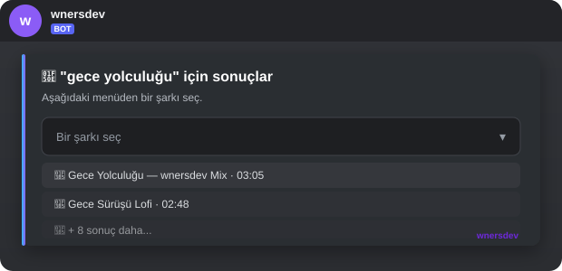
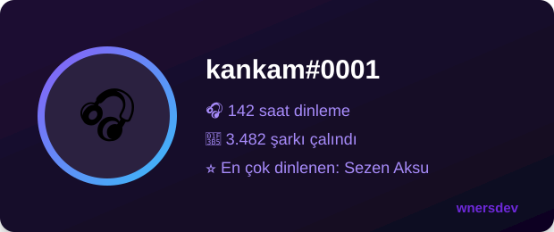

<div align="center">

# 🎵 wnersdev

### ✨ Sıfırdan Yazılmış • Ultra Gelişmiş • Türkçe Discord Müzik Botu ✨


```
██╗    ██╗███╗   ██╗███████╗██████╗ ███████╗██████╗ ███████╗██╗   ██╗
██║    ██║████╗  ██║██╔════╝██╔══██╗██╔════╝██╔══██╗██╔════╝██║   ██║
██║ █╗ ██║██╔██╗ ██║█████╗  ██████╔╝███████╗██║  ██║█████╗  ██║   ██║
██║███╗██║██║╚██╗██║██╔══╝  ██╔══██╗╚════██║██║  ██║██╔══╝  ╚██╗ ██╔╝
╚███╔███╔╝██║ ╚████║███████╗██║  ██║███████║██████╔╝███████╗ ╚████╔╝
 ╚══╝╚══╝ ╚═╝  ╚═══╝╚══════╝╚═╝  ╚═╝╚══════╝╚═════╝ ╚══════╝  ╚═══╝
```

**🎧 Müzik • 🤖 Yapay Zekâ • 🎨 Canvas • 🗄️ MongoDB • 🧩 Components V2**

[Özellikler](#-özellikler) •
[Kurulum](#️-kurulum) •
[Komutlar](#-komut-referansı-97-komut) •
[Proje Yapısı](#-proje-yapısı) •
[SSS](#-sık-sorulan-sorular)

</div>

<br/>

<div align="center">

<br/><sub>🎛️ Components V2 ile üretilen <b>Now Playing</b> kontrol paneli — tamamen butonlu</sub>
</div>

<br/>

## 🌌 wnersdev Nedir?

**wnersdev**, sıfırdan tasarlanmış, hazır bir bot şablonuna dayanmayan, **production kalitesinde** bir Discord müzik botudur. Tamamen Türkçe slash komutları, MongoDB ile kalıcı veri yönetimi, Discord'un en yeni arayüz teknolojisi **Components V2**, **Canvas** ile üretilen görsel profil kartları ve yapılandırılabilir bir **yapay zekâ katmanı** ile donatılmıştır.

> 💡 Bu proje "birkaç örnek dosya" değil — **97 çalışan slash komut**, **9 Mongoose modeli**, tam bir **buton/menü/panel sistemi** ve gerçek bir klasör mimarisiyle uçtan uca bağlı bir sistemdir.

<br/>

## 🧭 İçindekiler

| | | |
|---|---|---|
| 🌠 [Öne Çıkan Özellikler](#-özellikler) | 🧱 [Teknoloji Yığını](#-teknoloji-yığını) | ⚙️ [Kurulum](#️-kurulum) |
| 📁 [Proje Yapısı](#-proje-yapısı) | 📜 [Komut Referansı](#-komut-referansı-97-komut) | 🎛️ [Arayüz Önizlemeleri](#️-now-playing-kontrol-paneli) |
| 🔐 [ayarlar.json](#-ayarlarjson--güvenli-yapılandırma) | ❓ [SSS](#-sık-sorulan-sorular) | 🛡️ [Geliştirici](#️-geliştirici) |

<br/>

## 🌠 Özellikler

<table>
<tr>
<td width="33%" valign="top">

### 🎵 Müzik Motoru
- YouTube arama, link ve playlist desteği
- Duraklat / devam / geç / durdur
- Sar ⏩, döngü 🔁, karıştır 🔀
- Ses seviyesi, sessize alma
- 24/7 mod, otomatik oynatma
- Skip-vote (oylamayla geçme) sistemi

</td>
<td width="33%" valign="top">

### 🧩 Components V2 Arayüzü
- Buton kontrollü **Now Playing** paneli
- Select menülü **arama sonuçları**
- Kategorili, sayfalı **Yardım Paneli**
- Guild bazlı **Ayarlar** ekranı
- Mobilde de kusursuz görünüm 📱

</td>
<td width="33%" valign="top">

### 🤖 Yapay Zekâ Katmanı
- `.env` yerine `ayarlar.json` üzerinden yapılandırma
- Mood bazlı şarkı önerisi (`/ai-mood`)
- Doğal dil ile akıllı arama
- AI **asla** doğrudan stream etmez —
  sadece arama katmanına yönlendirir

</td>
</tr>
<tr>
<td width="33%" valign="top">

### 🗄️ MongoDB Kalıcılığı
- Favoriler, playlistler, geçmiş
- Sunucu bazlı ayarlar (`GuildMusicSettings`)
- İstatistikler (aggregation pipeline)
- Arama geçmişi + player state
- Gerekli tüm alanlarda **index**

</td>
<td width="33%" valign="top">

### 🎨 Canvas Görselleri
- Kişisel **müzik profil kartı** 🖼️
- Avatar, dinleme süresi, top sanatçı
- Marka: `wnersdev` her zaman görünür

</td>
<td width="33%" valign="top">

### 🛡️ Güvenlik & Performans
- Ses kanalı / DJ rolü / izin kontrolleri
- LRU önbellek (arama, metadata, ayarlar)
- Cooldown sistemi
- Merkezi hata yönetimi & loglama
- **`.env` yok**, her şey `ayarlar.json`'da

</td>
</tr>
</table>

<br/>

## 🧱 Teknoloji Yığını

| Katman | Teknoloji |
|---|---|
| 🤖 Bot Çekirdeği | `discord.js` v14 |
| 🎧 Müzik Motoru | `discord-player` v7 + `@discord-player/extractor` |
| 🗄️ Veritabanı | `MongoDB` + `Mongoose` |
| 🎨 Görsel Üretim | `canvas` |
| 🧠 Yapay Zekâ | Configurable Messages API (Anthropic uyumlu) |
| ⚡ Önbellek | `lru-cache` |
| 🔐 Yapılandırma | `ayarlar.json` (proje kökünde) |

<br/>

## ⚙️ Kurulum

```bash
# 1️⃣ Bağımlılıkları yükle
npm install
```

```json
// 2️⃣ Proje kökündeki ayarlar.json dosyasını doldur
// ⚠️ Bu proje .env KULLANMAZ — sadece ayarlar.json
{
  "DISCORD_TOKEN": "BOT_TOKENIN",
  "CLIENT_ID": "UYGULAMA_ID",
  "MONGODB_URI": "mongodb+srv://...",
  "YOUTUBE_API_KEY": "",
  "AI_API_KEY": "",
  "DEV_IDS": ["GELİŞTİRİCİ_DISCORD_ID"]
}
```

```bash
# 3️⃣ Slash komutlarını Discord'a deploy et
npm run deploy

# 4️⃣ Botu başlat 🚀
npm start
```

> 🗺️ **Discord Developer Portal** üzerinden: uygulama oluştur → bot ekle → token al → `bot` ve `applications.commands` scope'larını seç → `Guilds` ve `Voice States` intent'lerini aç.

<br/>

## 📁 Proje Yapısı

```
wnersdev/
├── 🔐 ayarlar.json      → Token & gizli anahtarlar (kod klasörlerinin DIŞINDA)
├── 📦 package.json
├── 🚀 index.js          → Giriş noktası
│
├── 📂 commands/          → 97 komut, 12 kategori
│   ├── muzik/            arama/           kuyruk/
│   ├── playlist/         favori/          kullanici/
│   ├── sunucu/           ai/              sanatci/
│   ├── kesfet/           eglence/         moderasyon/
│   └── sistem/
│
├── 📂 events/            → clientReady, interactionCreate, voiceStateUpdate...
├── 📂 handlers/          → commandHandler, eventHandler, deployCommands
├── 📂 music/             → player.js, playerEvents.js, Now Playing panel
├── 📂 search/            → Önbellekli arama servisi
├── 📂 ai/                → AI öneri katmanı
├── 📂 canvas/            → Profil kartı üretici
├── 📂 database/          → Mongoose bağlantısı + 9 model
├── 📂 components/        → buttons/, menus/, modals/ (Components V2)
├── 📂 locales/           → tr.json, en.json
├── 📂 services/          → i18n servisi
├── 📂 utils/             → embed, cache, logger, izin kontrolleri
├── 📂 config/            → Merkezi config (ayarlar.json okuyucu)
└── 🎨 emojis.js          → Merkezi emoji yönetimi
```

<br/>

## 🎛️ Now Playing Kontrol Paneli

Her şarkı başladığında Components V2 ile üretilen, **tamamen butonlu** bir panel gönderilir:

<div align="center">

</div>

Tüm butonlar **interaction security** katmanından geçer: kullanıcının ses kanalında olup olmadığı, botla aynı kanalda olup olmadığı ve DJ yetkisi otomatik kontrol edilir.

<br/>

## 🧩 Diğer Arayüz Önizlemeleri

<table>
<tr>
<td width="50%" align="center">
<br/>
<sub>🆘 <code>/yardım</code> — kategorili, select menülü dashboard</sub>
</td>
<td width="50%" align="center">
<br/>
<sub>🔎 <code>/ara</code> — select menülü arama sonuçları</sub>
</td>
</tr>
<tr>
<td width="50%" align="center" colspan="2">
<br/>
<sub>🎨 <code>/profil</code> — Canvas ile üretilen kişisel müzik profil kartı</sub>
</td>
</tr>
</table>

> 🖼️ Yukarıdaki görseller, botun gerçek Discord arayüzünü birebir yansıtan **SVG mockup**'lardır (<code>assets/</code> klasöründe). Bot bir sunucuya eklendiğinde arayüz aynı düzeni kullanır.

<br/>

## 📜 Komut Referansı (97 Komut)

<details open>
<summary><b>🎵 Müzik — 24 komut</b></summary>

| Komut | Açıklama |
|---|---|
| `/çal` | Şarkı, video veya playlist çalar |
| `/duraklat` | Çalan şarkıyı duraklatır |
| `/devam` | Duraklatılan şarkıyı devam ettirir |
| `/durdur` | Müziği durdurur, kuyruğu temizler |
| `/geç` | Şu an çalan şarkıyı geçer |
| `/şu-çalan` | Now Playing panelini gösterir |
| `/ses` | Ses seviyesini ayarlar (0-100) |
| `/sessize-al` / `/sesli` | Sesi kısar / geri açar |
| `/sar` | Şarkıda belirli saniyeye sarar |
| `/döngü` | Döngü modu: kapalı / şarkı / kuyruk |
| `/karıştır` | Kuyruğu karıştırır |
| `/otomatik-oynat` | Otomatik oynatmayı açar/kapatır |
| `/24-7` | 7/24 modunu açar/kapatır |
| `/radyo-başlat` | Tür bazlı sürekli yayın (10 tür) |
| `/radyo-tür` / `/radyo-sanatçı` / `/radyo-mood` | Serbest metin / sanatçı / AI mood ile radyo |
| `/radyo-durdur` | Radyo yayınını durdurur |
| `/şarkı-sözleri` | Şarkı sözlerini getirir |
| `/şarkı-bilgi` | Çalan şarkının detaylarını gösterir |
| `/şarkı-link` | Şarkının linkini verir |
| `/şarkı-tekrar` | Şarkıyı bir kez daha sıraya ekler |
| `/şarkı-paylaş` | Şarkıyı kanalda paylaşır |

</details>

<details>
<summary><b>🔎 Arama — 11 komut</b></summary>

| Komut | Açıklama |
|---|---|
| `/ara` | Select menülü genel arama |
| `/video-ara` | YouTube video araması |
| `/şarkı-ara` | Şarkı adıyla arama |
| `/sanatçı-ara` | Sanatçının popüler şarkılarını arar |
| `/akıllı-ara` | Doğal dil tarifiyle AI destekli arama |
| `/öner` | Geçmişine göre öneri üretir |
| `/benzer` | Çalan şarkıya benzer şarkılar bulur |
| `/rastgele` | Rastgele bir şarkı önerir |
| `/trend` | Sunucunun son 7 gün trendleri |
| `/popüler` | Global en popüler şarkılar |
| `/yeni-çıkan` | Yeni çıkan şarkıları arar |

</details>

<details>
<summary><b>📋 Kuyruk — 12 komut</b></summary>

| Komut | Açıklama |
|---|---|
| `/kuyruk` | Kuyruğu listeler |
| `/kuyruk-temizle` | Tüm kuyruğu temizler |
| `/kuyruktan-çıkar` | Belirli şarkıyı çıkarır |
| `/kuyrukta-taşı` | Şarkı sırasını değiştirir |
| `/kuyrukta-ara` | Kuyruk içinde arama yapar |
| `/kuyrukta-atla` | Belirli şarkıya atlar |
| `/kuyrukta-başa-al` | Şarkıyı başa alır |
| `/kuyruk-sırala` | Alfabetik sıralar (A-Z / Z-A) |
| `/kuyruk-kaydet` | Kuyruğu playlist olarak kaydeder |
| `/kuyruk-yükle` | Kayıtlı playlisti kuyruğa yükler |

</details>

<details>
<summary><b>🎼 Playlist — 1 komut (9 alt komut)</b></summary>

| Alt Komut | Açıklama |
|---|---|
| `/playlist oluştur` | Yeni playlist oluşturur |
| `/playlist sil` | Playlist siler |
| `/playlist ekle` / `çıkar` | Şarkı ekler / çıkarır |
| `/playlist liste` / `göster` | Playlistlerini / içeriğini listeler |
| `/playlist oynat` / `karıştır` | Playlisti çalar (sıralı / karışık) |
| `/playlist düzenle` | Adını değiştirir |
| `/playlist kopyala` | Playlisti kopyalar |
| `/playlist taşı` | İçindeki sırayı değiştirir |
| `/playlist paylaş` | Public yapar, paylaşım kodu üretir |
| `/playlist dışa-aktar` | Metin olarak dışa aktarır |

</details>

<details>
<summary><b>❤️ Favoriler — 6 komut</b></summary>

| Komut | Açıklama |
|---|---|
| `/favori-ekle` | Çalan şarkıyı favoriler eklerine ekler |
| `/favori-sil` | Favorilerden siler (autocomplete) |
| `/favoriler` | Favori listesini gösterir |
| `/favori-çal` | Favorilerden bir şarkı çalar |
| `/favori-kuyruğa-ekle` | Tüm favorileri kuyruğa ekler |
| `/favori-temizle` | Tüm favorileri temizler |

</details>

<details>
<summary><b>👤 Kullanıcı / Profil — 9 komut</b></summary>

| Komut | Açıklama |
|---|---|
| `/profil` / `/müzik-profilim` | Canvas müzik profil kartı 🎨 |
| `/dinleme-sürem` | Toplam dinleme sürenizi gösterir |
| `/en-çok-dinlediklerim` | En çok dinlenen şarkılar |
| `/en-çok-dinlediğim-sanatçılar` | En çok dinlenen sanatçılar |
| `/en-çok-dinlediğim-türler` | Dinleme eğilimi özeti |
| `/geçmiş` / `/geçmişim` | Dinleme geçmişini gösterir |
| `/geçmiş-temizle` | Geçmişi temizler |
| `/geçmişten-çal` | Geçmişten bir şarkı çalar |
| `/geçmişten-kuyruğa` | Son 10 şarkıyı kuyruğa ekler |

</details>

<details>
<summary><b>🤖 Yapay Zekâ — 2 komut</b></summary>

| Komut | Açıklama |
|---|---|
| `/ai-mood` | Ruh haline göre öneri üretir **ve çalar** |
| `/ai-öner` | Öneri üretir (otomatik çalmadan) |

</details>

<details>
<summary><b>🎤 Sanatçı — 3 komut</b></summary>

| Komut | Açıklama |
|---|---|
| `/sanatçı` | Genel bilgi + popüler şarkılar |
| `/sanatçı-bilgi` | AI destekli kısa biyografi |
| `/sanatçı-şarkıları` | Sanatçının şarkılarını kuyruğa ekler |

</details>

<details>
<summary><b>🧭 Keşfet — 5 komut</b></summary>

| Komut | Açıklama |
|---|---|
| `/keşfet` | Az bilinen / yeni şarkılar keşfeder |
| `/günün-şarkısı` | Günün önerilen şarkısı |
| `/günün-sanatçısı` | Günün önerilen sanatçısı |
| `/haftanın-şarkısı` | Sunucunun haftalık en çok çalınanı |
| `/yükselenler` | Yükselen şarkı/sanatçıları gösterir |

</details>

<details>
<summary><b>🎲 Eğlenceli — 4 komut</b></summary>

| Komut | Açıklama |
|---|---|
| `/müzik-ruleti` | Rastgele şarkı çekip kuyruğa ekler |
| `/rastgele-şarkı` | Rastgele bir şarkı adı gösterir |
| `/rastgele-sanatçı` | Rastgele bir sanatçı önerir |
| `/şarkı-tahmin` | 20 saniyelik tahmin oyunu 🎮 |

</details>

<details>
<summary><b>🛡️ DJ / Moderasyon — 6 komut</b></summary>

| Komut | Açıklama |
|---|---|
| `/dj-rol` | DJ rolünü ayarlar |
| `/müzik-izinleri` | Kimlerin şarkı isteyebileceğini belirler |
| `/müzik-kanalı` | Müzik komut kanalını ayarlar |
| `/istek-kanalı` | Şarkı istek kanalını ayarlar |
| `/duyuru-kanalı` | Yeni şarkı duyuru kanalını ayarlar |
| `/geç-oylaması` | Oylamayla şarkı geçme sistemi 🗳️ |

</details>

<details>
<summary><b>⚙️ Sunucu Ayarları & İstatistik — 8 komut</b></summary>

| Komut | Açıklama |
|---|---|
| `/ayarlar` | dil / dj / 24-7 / otomatik-oynat / ses / döngü / kuyruk / istek / duyuru / göster |
| `/istatistik` | Sunucu genel istatistikleri |
| `/haftalık-istatistik` / `/aylık-istatistik` | Dönemsel istatistikler |
| `/top-şarkılar` / `/top-sanatçılar` / `/top-kullanıcılar` | Sunucu sıralamaları |

</details>

<details>
<summary><b>🛠️ Geliştirici — 6 komut</b> <sub>(sadece <code>DEV_IDS</code>)</sub></summary>

| Komut | Açıklama |
|---|---|
| `/yardım` | Components V2 tam yardım paneli |
| `/bot-istatistik` | Bot durumu (ping, sunucu sayısı, bellek) |
| `/cache-temizle` | Tüm önbelleği temizler |
| `/player-sıfırla` | Sunucudaki player durumunu sıfırlar |
| `/komut-yenile` | Slash komutları canlı yeniden deploy eder |
| `/debug` | Sunucuya özel debug bilgisi gösterir |

</details>

<br/>

## 🔐 `ayarlar.json` — Güvenli Yapılandırma

<div align="center">

| ✅ Bu proje | ❌ Bu proje KULLANMAZ |
|---|---|
| `ayarlar.json` (kök dizinde) | `.env` dosyası |
| Kod klasörlerinden tamamen ayrı | Gizli anahtarları koddan okuma |

</div>

```json
{
  "DISCORD_TOKEN": "",
  "CLIENT_ID": "",
  "MONGODB_URI": "",
  "YOUTUBE_API_KEY": "",
  "AI_API_KEY": "",
  "DEV_IDS": []
}
```

`config/config.js`, uygulama açılışında bu dosyayı okur; dosya yoksa veya bozuksa anlaşılır bir hata verir.

<br/>

## ❓ Sık Sorulan Sorular

<details>
<summary><b>Neden discord.js Components V2 kullanıyorsunuz?</b></summary>
<br/>
Klasik embed + buton yapısına göre çok daha esnek bir düzen sunuyor: Container, Section, Thumbnail ve Separator bileşenleriyle gerçek bir "dashboard" hissi veriyor — hem masaüstünde hem mobilde.
</details>

<details>
<summary><b>AI doğrudan şarkı mı çalıyor?</b></summary>
<br/>
Hayır. AI katmanı sadece <b>arama sorgusu / öneri</b> üretir; gerçek şarkı her zaman <code>search/searchService.js</code> üzerinden YouTube'dan gelir.
</details>

<details>
<summary><b>MongoDB olmadan çalışır mı?</b></summary>
<br/>
Hayır — favoriler, playlistler, geçmiş ve sunucu ayarları tamamen MongoDB'de tutulur. <code>MONGODB_URI</code> zorunludur.
</details>

<br/>

## 🛡️ Geliştirici

<div align="center">

### 🎵 wnersdev

*Sıfırdan, tutkuyla, Türkçe olarak yazıldı.*


</div>
